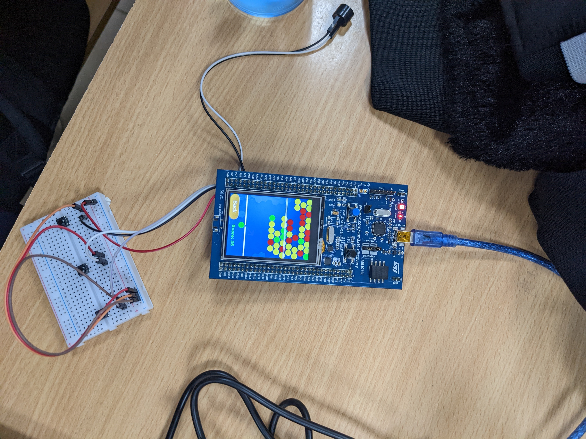

# Mô tả

EggShooting là phiên bản đơn giản của trò chơi Dynomite! (bắn trứng khủng long) của hãng game Popcap nhưng được xây dựng để có thể chơi trên kit phát triển STM32F429I-DISC1. Dự án được xây dựng để phục vụ cho học phần Hệ nhúng (IT4210). Chi tiết về việc phát triển dự án được viết lại đầy đủ trong [báo cáo bài tập lớn](report/report.pdf).

# Hướng dẫn sử dụng

## Lắp mạch
Thiết bị sử dụng:
- Kit phát triển STM32F429I-DISC1
- Loa buzzer 3V
    - Chân (+) nối tới chân PA9 của kit STM32
    - Chân (-) nối tới chân GND của kit STM32
- Ba nút bấm 
    - Lắp vào mạch với cấu hình là pull-up mode
    - Nút dịch trái nối tới chân PG2
    - Nút dịch phải nối tới chân PG3
    - Nút bắn nối tới chân PA14

## Môi trường lập trình:
- STM32 CubeIDE: IDE + compiler + debugger
- STM32CubeF4: driver + library
- ST-LINK009: USB driver
- TouchGFX: GUI design

# Demo

Các video demo khác được lưu trong folder `videos`

https://github.com/user-attachments/assets/feb930c8-9e68-4490-a6c8-f4fe10c11c26

# Lưu ý

1. Một vài lỗi nhỏ (hiếm gặp) trong việc xử lý nổ trứng đã gặp phải trong quá trình chơi:
    - Một số quả bóng lơ lửng không bị nổ (các quả trứng nằm ở biên trái màn hình).
    - Quả trứng khi bắn ra rơi vào ô đi qua vạch kẻ thua nhưng vẫn nổ trứng, và trò chơi tiếp tục diễn ra.
2. Project không sử dụng đến file `.ioc` nên phần code khởi tạo và file cấu hình `.ioc` có thể không trùng khớp.
3. Phần gạch trắng ở phía trên màn hình trong các demo là lỗi màn hình hiển thị của kit, không phải tính năng của trò chơi.
